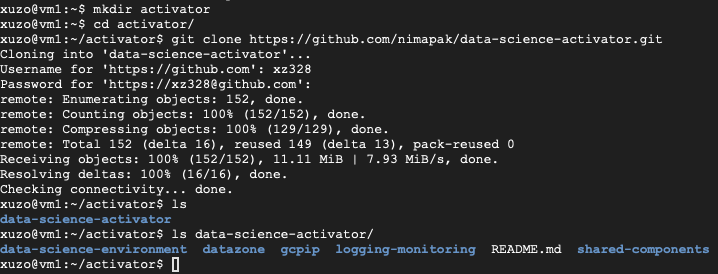
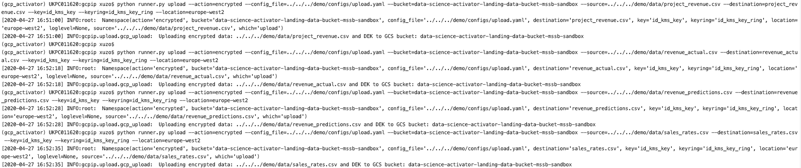
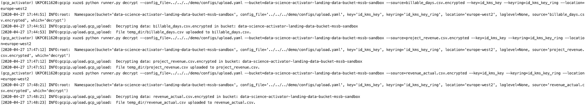
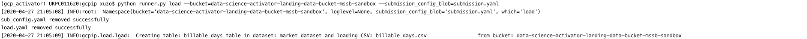
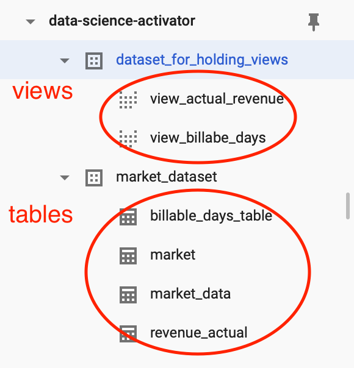
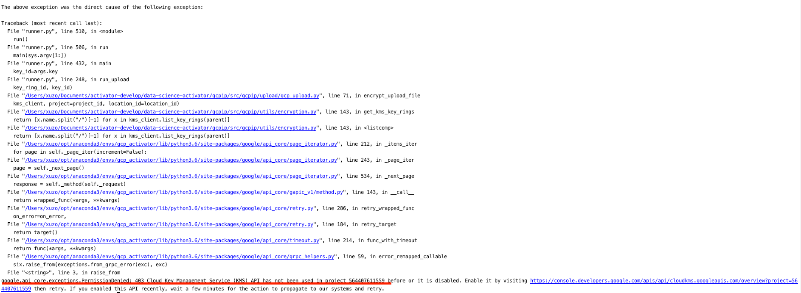

# Part 1 - Data landing zone
In the first section, the data-landing-zone infrastructure was built using Terraform code.
## Step 1 – Installation of Terraform
See [README.md](../README.md)


## Step 2 – Setup GCP project

See [README.md](../README.md)

## Step 3 – Initialize your project

### 3.1 Clone the data-science-activator

Run the following script to clone the `data-science-activator` repository from GitHub. The GitHub username and 
password
```shell script
git clone https://github.com/nimapak/data-science-activator.git
```
Once the GCP environment is created in the following steps, the same code can be run on a virtual machine (VM)
to clone the code to the VM. See below



### 3.2 Install shared-components first within the package

- Change directory to folder `shared-components/`
- Run scripts:
  - `terraform init`
  - `terraform validate`
  - `terraform plan`
  - `terraform apply`
### 3.3 install data-zone
- change directory to folder `datazone/`
- Run scripts:
  - `terraform init`
  - `terraform validate`
  - `terraform plan`
  - `terraform apply`
### 3.4 install data-science-environment?

# Part 2 - ETL using gcpip
In the second part of the demo, the following ETL tasks are demonstrated using the `gcpip` package: 
- upload data on premises securely to the Cloud Stroage bucket;
- load data from the Cloud Storage bucket to BigQuery;
- generate Bigquery views from the Biquery tables

Details can refer to the documentation of gcpip at 
[readme.md](https://git.gft.com/napt/data-science-activator/blob/master/gcpip/readme.md)

## Step 4 – Uploading data from local storage to Cloud Storage securely

The data to be upload from local storage to the cloud storage is the pre-processed csv files 
using `kedro`. The pre-processing is out of the scope of the demo, so the details are not included
here. Basically, in the pre-processing, data from various worksheets of different workbooks are
automatically extracted and compiled into different csv files through a `kedro` pipeline. The 
pre-processed csv files for this demo is located in the folder `demo/data`. 

Tools are provided to encrypt data locally before transit using Cloud KMS. This migration will
upload the unencrypted data (with a `.encrypted` extension) together with a key file (with an `.dek` extension). 
Once the data is uploaded to the Cloud Storage, run the decrypt script removing the .encrypted and `.dek` files.

The whole uploading process consists of the following steps:

1. Change directory to `data-science-activator/gcpip/src/gcpip/`
2. Run the following scripts to upload the `data` (csv files)
    ```shell script
    python runner.py upload --action=encrypted --config_file=../../../demo/configs/upload.yaml --bucket=data-science-activator-landing-data-bucket-mssb-sandbox --source=../../../demo/data/billable_days.csv --destination=billable_days.csv --key=id_kms_key --keyring=id_kms_key_ring --location=europe-west2
    python runner.py upload --action=encrypted --config_file=../../../demo/configs/upload.yaml --bucket=data-science-activator-landing-data-bucket-mssb-sandbox --source=../../../demo/data/kimble_dump.csv --destination=kimble_dump.csv --key=id_kms_key --keyring=id_kms_key_ring --location=europe-west2
    python runner.py upload --action=encrypted --config_file=../../../demo/configs/upload.yaml --bucket=data-science-activator-landing-data-bucket-mssb-sandbox --source=../../../demo/data/project_revenue.csv --destination=project_revenue.csv --key=id_kms_key --keyring=id_kms_key_ring --location=europe-west2
    python runner.py upload --action=encrypted --config_file=../../../demo/configs/upload.yaml --bucket=data-science-activator-landing-data-bucket-mssb-sandbox --source=../../../demo/data/revenue_actual.csv --destination=revenue_actual.csv --key=id_kms_key --keyring=id_kms_key_ring --location=europe-west2
    python runner.py upload --action=encrypted --config_file=../../../demo/configs/upload.yaml --bucket=data-science-activator-landing-data-bucket-mssb-sandbox --source=../../../demo/data/revenue_predictions.csv --destination=revenue_predictions.csv --key=id_kms_key --keyring=id_kms_key_ring --location=europe-west2
    python runner.py upload --action=encrypted --config_file=../../../demo/configs/upload.yaml --bucket=data-science-activator-landing-data-bucket-mssb-sandbox --source=../../../demo/data/sales_rates.csv --destination=sales_rates.csv --key=id_kms_key --keyring=id_kms_key_ring --location=europe-west2
    ```    
   
   **Note: [kimble_dump.csv](data/kimble_dump.csv) is uable to be uploaded due to timeout error**
3. Run the following scripts to decrypt the encrypted files at Cloud Storage
    ```shell script
    python runner.py decrypt --config_file=../../../demo/configs/upload.yaml --bucket=data-science-activator-landing-data-bucket-mssb-sandbox --source=billable_days.csv.encrypted --key=id_kms_key --keyring=id_kms_key_ring --location=europe-west2
    python runner.py decrypt --config_file=../../../demo/configs/upload.yaml --bucket=data-science-activator-landing-data-bucket-mssb-sandbox --source=project_revenue.csv.encrypted --key=id_kms_key --keyring=id_kms_key_ring --location=europe-west2
    python runner.py decrypt --config_file=../../../demo/configs/upload.yaml --bucket=data-science-activator-landing-data-bucket-mssb-sandbox --source=revenue_actual.csv.encrypted --key=id_kms_key --keyring=id_kms_key_ring --location=europe-west2
    python runner.py decrypt --config_file=../../../demo/configs/upload.yaml --bucket=data-science-activator-landing-data-bucket-mssb-sandbox --source=revenue_predictions.csv.encrypted --key=id_kms_key --keyring=id_kms_key_ring --location=europe-west2
    python runner.py decrypt --config_file=../../../demo/configs/upload.yaml --bucket=data-science-activator-landing-data-bucket-mssb-sandbox --source=sales_rates.csv.encrypted --key=id_kms_key --keyring=id_kms_key_ring --location=europe-west2
    ```
   It is as shown below
   
    **Note: These shell scripts were run on local machine due to GitLab access issue from VM. Running on local machine may have a side effect of a (much) lower speed.**

The [upload.yaml](configs/upload.yaml) file is as following
```yaml
dlp:
    info_types:
        - EMAIL_ADDRESS
        - FIRST_NAME
        - LAST_NAME
project_name: data-science-activator
key_file: ../../../../data-science-activator-key.json
```
## Step 5 – Loading data from Cloud Storage to BigQuery
Three files are required to execute the loading of data from Cloud Storage to BigQuery:
- the `submission configuration file`([submission.yaml](configs/submission.yaml)), defining the type of action and the configuration file location
- the `load configuration file` ([load.yaml](configs/load.yaml)), defining the configuration of the action
- the `raw data` to be loaded from Cloud Storage to BigQuery

Since the raw data already rest in the Cloud Storage after the above step, we only need to upload the two configuration 
files to the GCS bucket following the steps in the previous step. The configuration files are not sensitive data so 
we can simply use `plain` action to upload the files directly 
to the GCS bucket from local storage running the following scripts
```shell script
python runner.py upload --action=plain --config_file=../../../demo/configs/upload.yaml --bucket=data-science-activator-landing-data-bucket-mssb-sandbox --source=../../../demo/configs/load_actual_revenue.yaml --destination=meta/load_actual_revenue.yaml
python runner.py upload --action=plain --config_file=../../../demo/configs/upload.yaml --bucket=data-science-activator-landing-data-bucket-mssb-sandbox --source=../../../demo/configs/submission_load_actual_revenue.yaml --destination=submission_load_actual_revenue.yaml
```

The [load.yaml](configs/load.yaml) file is like

```yaml
key_file: ../../../../data-science-activator-key.json
project_id: data-science-activator
mode: big_query
sources:
  source1:
    bucket_id: data-science-activator-landing-data-bucket-mssb-sandbox
    file_path: billable_days.csv
    file_type: csv
    skip_leading_rows: 1
destination:
  schema:
    field1:
      name: country
      type: STRING
      mode: required
    field2:
      name: jan_01_2019
      type: FLOAT
      mode: nullable
    ...
    ...
    field32:
      name: dec_01_2018
      type: FLOAT
      mode: nullable
  dataset: market_dataset
  table: billable_days_table
```

The [submission.yaml](configs/submission.yaml) file is as:
```yaml
submissions:
    submission1:
        submission_name: load_files_from_gcs_to_bq
        metadata_file: data-science-activator-landing-data-bucket-mssb-sandbox/meta/load.yaml
        data_file: data-science-activator-landing-data-bucket-mssb-sandbox/billable_days.csv
        action: load
```

Then, run the following to loader to load data from gcs bucket to BigQuery table according to the configuration files

```shell script
python runner.py load --bucket=data-science-activator-landing-data-bucket-mssb-sandbox --submission_config_blob=submission.yaml
```



**Note**: 
1. When defining the schema, the mode of the field which can be nullable should be set as NULLABLE in the load yaml file. 
2. DATE columns must use the dash (-) separator and the date must be in the following format: YYYY-MM-DD (year-month-day), 
as documented in [Loading CSV data from Cloud Storage](https://cloud.google.com/bigquery/docs/loading-data-cloud-storage-csv#csv_encoding)

Otherwise, the table will not be imported properly.

**Bug alert! when upload the load.yaml file to gcs bucket, it must be uploaded to the folder `meta/`. Otherwise, it 
will give error config file cannot be found. This is becuase `meta/` is hardcoded
## Step 6 - Creating BigQuery views


```shell script
python runner.py bq_view --bucket=data-science-activator-landing-data-bucket-mssb-sandbox --submission_config_blob=submission_view.yaml
```

**Note**: The column names in the views are actually the same as the original (which should be able to 
be changed as defined in the yaml file).




# Exisiting issues

1. upload/load multiple files
2. git not installed through init files on vm
3. git need to be configured
3. need to enable the Cloud Key Management Service (KMS) API manually. 
   
4. the timed out error during uploading
uploading of kimble_dump.csv file timed out; the file size is 80.9 mb
5. bug - config files must be uploaded to meta/ folder in the gcs bucket due to hardcoding
6. tables created in bq are empty!! - solved (nullable fields and date format)